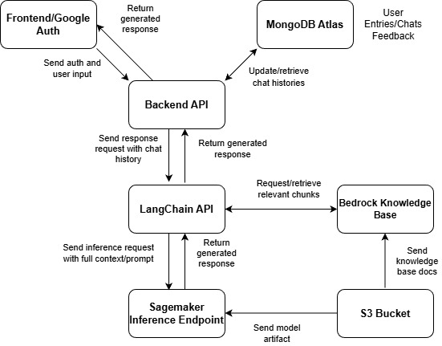

# AI-Powered CBT RAG Journal

An AI-powered journal that retrieves relevant context from Cognitive Behavioral Therapy (CBT) documentation and generates personalized reflections and responses using a locally hosted LLM. Local hosting ensures user data remains confined within the system rather than being sent to external services.

The architecture diagram is included at the end of this document. This repository covers the entire inference stack of the project. The entire project was developed with a team of 5.

Full project writeup and summary can be found here: https://www.ischool.berkeley.edu/projects/2025/refraime

---

## Overview of Modules

### 1. SageMaker Inference Endpoint

A script to specify a model path on AWS (an S3 bucket) and an instance type, then deploy it as a SageMaker inference endpoint. The endpoint name is dynamically generated based on a timestamp.

**vLLM Optimization Features:**

The deployment image uses vLLM to serve the model with Paged Attention, enabling efficient continuous batching of inference requests. It also supports block-based KV caching of prefixes, where each block contains a fixed number of tokens. This means an entire prefix doesn't need to be identical to benefit from reduced computation—only blocks of tokens that are completely identical avoid recomputation. Recomputation begins at the block where the first deviation is detected and continues onward.

This is particularly useful for system prompts, portions of which are identical across all inference requests. Equivalence is checked by comparing block hashes and recursively growing the hash with each additional block. This prevents a cached block from being incorrectly considered identical when preceding blocks may have differed, which would affect KV values.

**Model Selection:**

Balancing latency, cost, and output quality, the final model used was Gemma 2 9B IT, quantized with AWQ at 4 bits (cloned from Hugging Face).

**Deployment Instructions:**

1. Specify the following in the script:
   - AWS region
   - SageMaker Executor role
   - S3 bucket path to the model folder
   - Subnet IDs for your VPC
   - Security group ID
   - Instance type (default: `ml.g6.4xlarge`)

2. Run the script from a JupyterLab instance in SageMaker Studio to avoid access and dependency issues.

3. Copy the endpoint name from SageMaker once populated.

---

### 2. Bedrock Knowledge Base

A knowledge base configured in AWS Bedrock serves as a vector store for CBT documents. Documents were sourced from publicly accessible webpages, manually scraped and cleaned (due to the low document count), converted to DOCX format, and uploaded to an S3 bucket folder.

**Configuration:**
- Chunk size: 384 tokens
- Overlap: 50%
- Vector store: Amazon OpenSearch Serverless (for lower latency)

---

### 3. LangChain API

A FastAPI application that handles inference requests by:

1. Retrieving appropriate context from the AWS Bedrock Knowledge Base
2. Constructing a full prompt with retrieved context, previous chat history, and the journal entry
3. Sending the request to the SageMaker endpoint

The system prompt and additional context are arranged to minimize variability at the beginning of the request (rapidly changing data like chat history is placed near the end). This ordering maximizes the effectiveness of prefix caching, reducing GPU load and latency.

**Deployment Instructions:**

1. Set up an Elastic Beanstalk service on AWS.
2. Upload the zip file containing the application, requirements, and Dockerfile.
3. Set the following environment variables (refer to `getenv` calls in the config file for exact naming):
   - AWS Region
   - Bedrock Knowledge Base ID
   - SageMaker Endpoint Name
4. Note the service URL for use in the Backend API configuration.

---

### 4. Backend API

An API that:

- Accepts and responds to requests from the frontend
- Updates entries and chat histories in MongoDB Atlas as conversations progress
- Queries MongoDB to construct proper requests to the LangChain API
- Handles authentication via Google

**Deployment Instructions:**

1. Set up an Elastic Beanstalk service on AWS.
2. Upload the zip file containing the application, requirements, and Dockerfile.
3. Set the following environment variables (refer to `getenv` calls in the main file for exact naming):
   - Web Domain for Application
   - Web Client ID (for Google Authentication)
   - Secret Key (for MongoDB instance)
   - Algorithm (encryption algorithm for MongoDB)
   - LangChain API URL
   - Mongo URI

---

## Architecture Diagram

---

## Team

Shyam Patel, Michael Garfagnoli, Sineli Gamage, Hannah Macdonald, and Bradley Igercich
